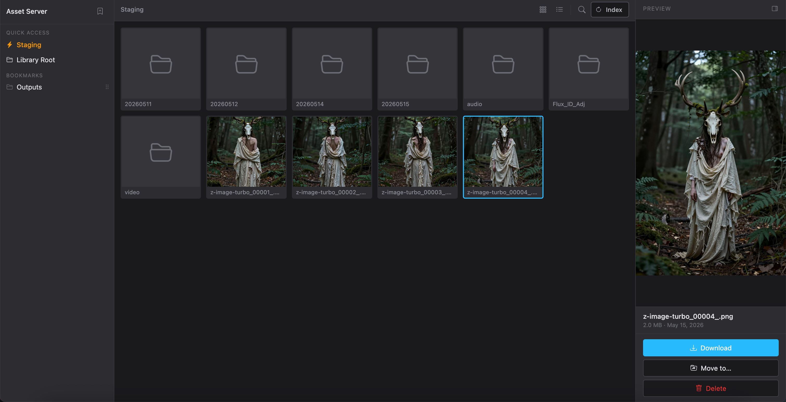

# Asset Server

Browser-based file explorer for managing ComfyUI outputs and asset libraries. Runs on your Linux server, accessed from any browser on the local network.



## Setup

```bash
# 1. Clone and install
npm install

# 2. Create your config
cp config.example.json config.json
```

Edit `config.json` — set your actual paths:

```json
{
  "roots": {
    "staging": "/home/ervinne/comfyui/output",
    "library": "/mnt/windows/Others/LinuxFiles/resources_and_outputs"
  },
  "bookmarks": [...],
  "port": 3000
}
```

```bash
# 3. Start
npm start

# Or with auto-restart on file changes (Node 18+)
npm run dev
```

Open `http://forge:3000` from your Mac.

## First run checklist

- [ ] Hit **↻ Index** in the toolbar to build the search index for your library
- [ ] Add bookmarks via the **+** button in the sidebar (navigate to a folder first)
- [ ] Staging folder opens automatically on load if configured

## Keyboard shortcuts

| Key | Action |
|-----|--------|
| `→` / `↓` | Next item (↓ jumps a full row in grid view) |
| `←` / `↑` | Prev item (↑ jumps a full row in grid view) |
| `Enter` | Open folder / open file in new tab |
| `Backspace` | Go up one folder (when nothing selected) |
| `d` / `Delete` | Soft-delete selected file (5 s undo toast) |
| `Backspace` | Soft-delete selected file (when a file is selected) |
| `Space` | Play / pause video preview |

## Make it a service

Run on boot with systemd. Copy the sample unit file and enable it:

```bash
sudo cp scripts/asset-server.service /etc/systemd/system/asset-server.service
sudo systemctl daemon-reload
sudo systemctl enable asset-server
sudo systemctl start asset-server
```

The unit file runs as user `ervinne` from `/home/ervinne/projects/asset-server`. Edit those if your setup differs.

To allow `deploy.sh` to restart the service without a password prompt:

```bash
echo 'ervinne ALL=(ALL) NOPASSWD: /bin/systemctl restart asset-server' \
  | sudo tee /etc/sudoers.d/asset-server
```

## Usage notes

- **Move to…** — opens a folder tree rooted at your library. Expand folders with the arrow, click to select destination, confirm.
- **Search** — searches the library index only (not staging). Rebuild the index after adding new files to the library.
- **Staging auto-refresh** — the staging folder refreshes every 5 s automatically while you're in it.
- **URL bookmarking** — the browser URL updates as you navigate (`/staging/subfolder`, `/library/Outputs/Name`). Bookmark any folder directly in Chrome.
- Click a preview image to open it full-size in a new tab.
- Index is stored in `index/library.json` (git-ignored). Staging is not indexed — it's too high-churn.
